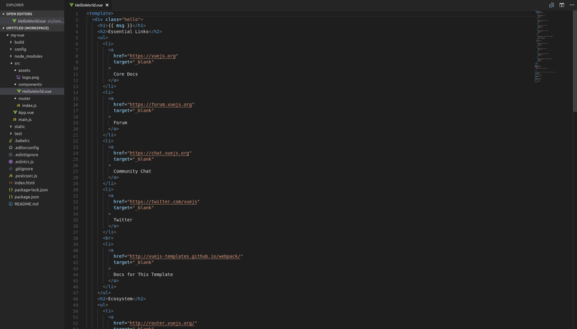
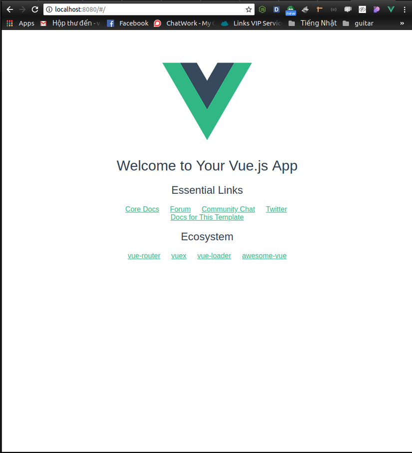
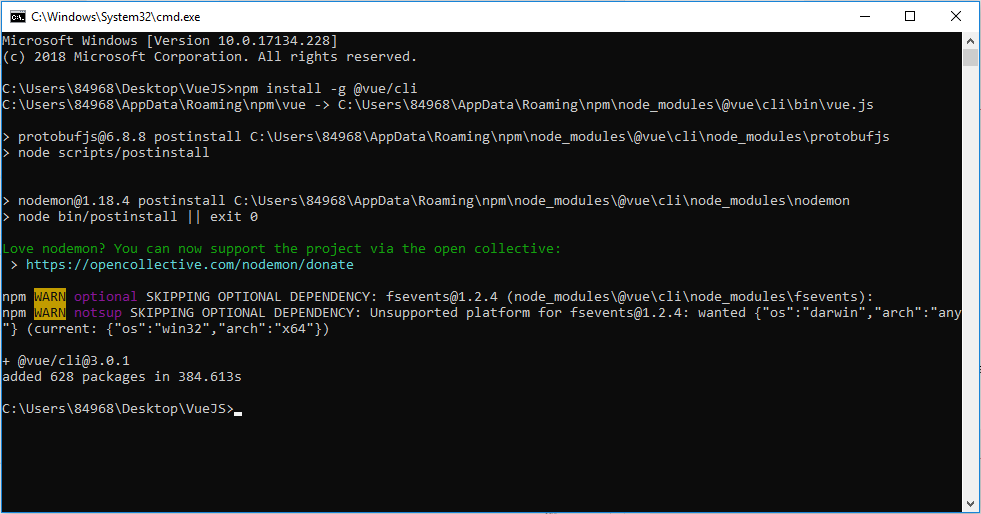
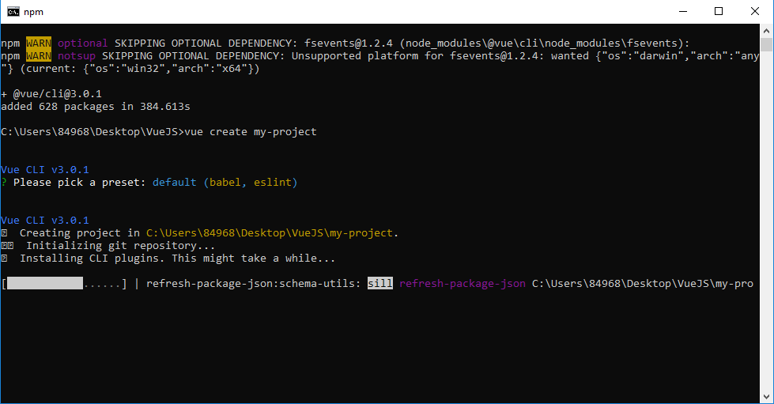
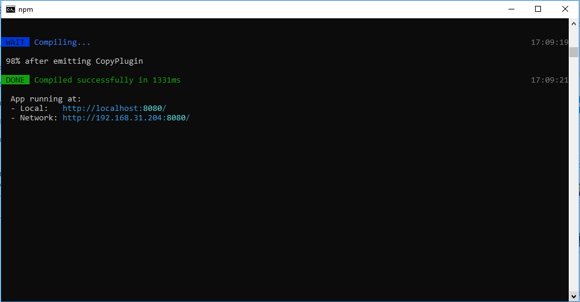

# LẬP TRÌNH  FRONT-END

# VueJS

### I. NỘI DUNG TÌM HIỂU

#### 1. VueJS là gì?
**Vue.js** (View) là 1 thư viện Javascript UI mới (again) đang khá là hot trong thời gian gần đây.
 Vue.js là một framework linh động, dùng để xây dựng giao diện người dùng (user interfaces). Vue cũng đáp ứng được dễ dàng nhu cầu xây dựng những ứng dụng một trang (SPA - Single-Page Applications) với độ phức tạp cao hơn nhiều.
    
  - **Cách sử dụng:** Để sử dụng Vue thì rất là đơn giản. Chỉ cần thêm đoạn script HTML này vào là bạn đã có thể sử dụng Vue trong trang web

  ```javascript
  <script src="https://unpkg.com/vue@next/dist/vue.js"></script>
  ```
   Hoặc bạn có thể [Cài đặt Node kèm Npm:](https://nodejs.org/en/download/)
                    Cài đặt vue bằng npm:
                    Sử dụng câu lệnh **npm install vue**
                    
   Khi đã làm quen, bạn nên cài đặt thêm Vue-CLI (Command Line Interface) giúp nhanh chóng khởi tạo nền tảng cho các ứng dụng.
   
   Cài đặt vue-cli : **npm install --global vue-cli** or **npm install vue-cli** (Các bước chi tiết ở cuối bài viết này)
   
   **vue webpack my-project** => tạo một dự án mới với tên là "my-project"
   
   **cd my-project** => vào thư mục chứa project
   
   **npm run serve** => chạy server
   
   Hình ảnh cấu trúc thư mục project:
   
   
   
   Hình ảnh khi chạy (cổng mặc định là 8080):
   
   
   
#### Render theo hướng khai báo
   
Sau đây là 1 instance Vue. Trong đó trường el là trường sẽ được gắn kết.

Dữ liệu để gắn kết tới el đã được định danh ở phía trên sẽ được định nghĩa ở trong trường data, và dữ liệu này sẽ được truy cập qua các template.

Để rõ hơn thì mình có 1 đoạn code HTML như sau:
```html
<div id="app">
  <p>{{ message }}</p>
</div>
```
1 điều cần lưu ý ở đây là thẻ div với id mà chúng ta đã trỏ tới ở phía trên. Và 2 dấu ngoặc nhọn **{{ message }}** được sử dụng để hiển thị dữ liệu được truyền tới.

 ```javascript
  new Vue({
  el: '#app',
  data: {
    message: 'Welcome to Vue.JS!',
  }
})
  ```
  
  Ngoài việc quản lí và chỉnh sửa văn bản, chúng ta cũng có thể bind (ràng buộc) các thuộc tính của phần tử web, như sau:
  
  ```html
  <div id="app-2">
    <span v-bind:title="message">
      Rê chuột lên đây một vài giây để xem thuộc tính `title` được bind!
    </span>
  </div>
  ```
  
```javascript
   new Vue({
      el: '#app-2',
      data: {
        message: 'Bạn đã mở trang này vào ' + new Date().toLocaleString()
      }
   })
```
  
 - **Điều kiện**
Vue cung cấp cho chúng ta 1 tính năng khá là hữu dụng như là khả năng binding data tới view theo điều kiện. 

   - Example:

```javascript
new Vue({
  el: '#app',
  data: {
    message: 'Welcome to Vue.JS!',
    // điều kiện
    newMember: true
  }
})
 ```
 
 ```html
<div id="app">
  <!-- Display chỉ khi newMember = true -->
  <h2 v-if="newMember">{{ message }}</h2>
  <!-- Display chỉ khi newMember = false -->
  <h2 v-else>Pick a Mentor ( newMember: false )</h2>
</div>
 ```
**v-if** và **v-else** được dùng cho việc display data theo điều kiện. Và về cách sử dụng thì như là if-else trong các ngôn ngữ lập trình.

- **Vòng Lặp**

Ngoài việc là thực hiện binding theo điều kiện thì Vue cũng có duyệt data theo mảng.

 ```html
<div id="app">
    <ol>
        <li v-for="mentor in mentors">
            {{mentor.fullname}}
        </li>
     </ol>
</div>
 ```
Câu lệnh điều hướng **v-for** ở trên tạo 1 biến **mentor** và sử dụng biến này để duyệt hết các phần tử trong array **mentors**.

```javascript
var vue = new Vue({
el: '#app',
data: {
  // Array of mentors
      mentors: [
        { fullname: "Arup Rakshit"},
        { fullname: "Mo Moadeli"},
        { fullname: "Khaja Minhajuddin"},
        { fullname: "bendozy"},
        { fullname: "Massimo Frascati"},
        { fullname: "Christian Nwamba"}
      ]
    }
})
```
Bây giờ nếu nhập **vue.todos.push({ fullname: 'Christian Ronaldo' })**, bạn sẽ thấy danh sách có thêm một mục mới.

- **Two-Way Binding** trong Vue được sử dụng qua câu lệnh **v-model**. Điều này sẽ thể hiện rõ hơn qua ví dụ.

    - Example:

     ```html
    <div id="app">
        Add mentor:
        <input type="text" v-model="mentor">
         <p>Two-Way Binding Here: {{mentor}}</p>
    </div>
    ```
    ```javascript
    <script>
        new Vue({
            el: '#app',
            data: {
                mentor: ''
            }
        });
    </script>
    ```

- **Xử lí sự kiện** Trong các ứng dụng web thì việc xử lí các sự kiện rất là quan trọng. Gỉa sử như chúng ta cần collect mentor content và status.

  ```html
    <div id="app">
        <p>
            <input type="text" v-model="mentor"/>
        </p>

        <button v-on:click="addMentor">Add Mentor</button>
      
        <ol>
            <li v-for="item in mentors">{{item}}</li>
        </ol>
    </div>
    ```
    
     ```javascript
    <script>
        new Vue({
            el: '#app',
            data: {
                mentor: "",
                mentors: [
                ]
            },
            methods: {
                addMentor: function () {
                    if (this.mentor != "") {
                        this.mentors.push({ 
                            content: this.mentor,
                            status: false
                        })
                        this.mentor = ""
                    }
                }
            }
        })
    </script>
    ```

- **Compenents** là 1 trong những tính năng mạnh mẽ của Vue. Tính năng giúp chúng ta đóng gói các HTML element để tiện cho tái sử dụng trong codebase.
    Hệ thống component (phần tử cấu thành) là một khái niệm quan trọng trong Vue, vì nó cho phép chúng ta xây dựng những ứng dụng quy mô lớn được tạo thành từ những phần tử nhỏ, độc lập, và thường là tái sử dụng được.

    - Example

```html
<template>
    <div>
        <p>Button 1</p>
            <button-counter></button-counter>
        <p>Button 2</p>
            <button-counter></button-counter>
        <p>Button 3</p>
            <button-counter></button-counter>
    </div>
</template>
```

```javascript
    Vue.component('button-counter', {
  data: function () {
    return {
      count: 0
    }
  },
  template: '<button v-on:click="count++">Bạn đã bấm {{ count }} lần.</button>'
})
```

- **Props** Props trong Vue dùng để chuyền data từ component parent xuống component child.

 - Example ComponentParent

```html
<template>
    <div>
        <ComponentChild :content="content"></ComponentChild>
    </div>
</template>
```

```javascript
<script>
import ComponentChild from "ComponentChild.vue";
    new Vue({
    name: 'ComponentParent',
    components: {
        ComponentChild, 
    },
    data() {
        return {
            content: "Helllo ComponentChild!"
        }
    }
  })
</script>
```

- Example ComponentChild

```html
<template>
    <div>
        <p>{{content}}</p>
    </div>
</template>
```

```javascript
<script>
    new Vue({
    name: 'ComponentChild',
    props: {
        content: {
            type: String
        }, 
    },
  })
</script>
```

- **Emit** **emit** trong Vue dùng để chuyền data từ component child lên component parent.

 - Example ComponentParent

```html
<template>
    <div>
        <ComponentChild @on-data="onClick"></ComponentChild>
        
        <p>{{content}}</p>
    </div>
</template>
```

```javascript
<script>
import ComponentChild from "ComponentChild.vue";
    new Vue({
    name: 'ComponentParent',
    components: {
        ComponentChild, 
    },
    data() {
        return {
            content: "",
        },
    },
     methods: {
        onClick(value) {
            // gán giá trị được chuyền lên từ component child vào biến content
            this.content = value;
           }
        }
  })
</script>
```

- Example ComponentChild

```html
<template>
    <div>
        <p>This is component child</p>
        <button @click="onClick">Click here!!!</button>
    </div>
</template>
```

```javascript
<script>
    new Vue({
    name: 'ComponentChild',
    data() {
        return {
            content: 'Your click component Child'
        }
    }
    methods: {
        onClick() {
            // Chuyền dữ liệu từ component con lên component cha thông qua $emit
            this.$emit('on-data', this.content);
        }
    }
  })
</script>
```
**Computed**: Computed trong Vue là khi giá trị bên trong nó 'return' thay đổi thì giá trị 'reversedMessage' cũng tự động thay đổi theo.

- Example

```html
<template>
  <div id="example">
    <p>Original message: "{{ message }}"</p>
    <p>Computed reversed message: "{{ reversedMessage }}"</p>
  </div>
</template>
```

```javascript
<script>
   var vm = new Vue({
     el: '#example',
     data: {
       message: 'Hello'
     },
     computed: {
       reversedMessage: ()=> {
         return this.message.split('').reverse().join('')
       }
     }
   })
</script>
```

**Watch**: **watch** trong Vue khi giá trị 'isChange' được thay đổi, thì nó sẽ thực hiện những gì bên trong hàm đó.
**Created**: **created** trong Vue khi component được sử dụng tới thì các giá trị bên trong 'created' sẽ được khởi tạo.

- Example

```html
<template>
  <div id="example">
    <p>Original message: "{{ message }}"</p>
    <p>Computed reversed message: "{{ reversedMessage }}"</p>
  </div>
</template>
```

```javascript
<script>
   var vm = new Vue({
     el: '#example',
     data: {
       message: 'Hello World',
       reversedMessage:'',
       isChange: false,
     },
     created(){
       this.changeTimeOut();  
     },
     watch: {
       isChange() {
          this.reversedMessage = this.message;
       }
     },
     methods: {
         changeTimeOut() {
             setTimeout(function(){ this.isChange = true; }, 3000);
         }
     }
   })
</script>
```
#### 2. Vue Cli
 
  - Bước 1: Để chạy được VueJS trên server, ta tạo 1 folder vào thanh local gõ cmd để bật màn hình console và gõ lệnh **npm install -g @vue/cli**
    - Hình ảnh:
 


  - Bước 2: Chạy tiếp lệnh **vue create my-project** để tạo dự án, trong đó **my-project** là tên dự án.
    - Hình ảnh:
 


 - Bước 3: Để chạy được VueJS trên sever ta chạy lệnh sau: **npm run serve**
    - Kết quả:
        

 - Bước 4: Chạy Link này trên trình duyệt sẽ thấy giao diện của Vue: <br>
  App running at:
    - Local:   http://localhost:8080/
    - Network: http://192.168.31.204:8080/

### II.	YÊU CẦU

Tự tìm hiểu về VueJS và viết báo cáo những nội dung có liên quan

### III.	NỘP BÀI

- doc: Báo Cáo (README.md).
- Tạo Project trên Github và gửi Link cho người hướng dẫn:
